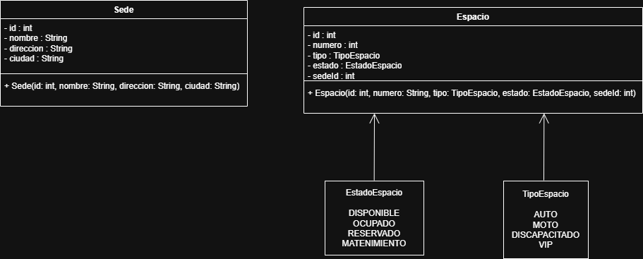
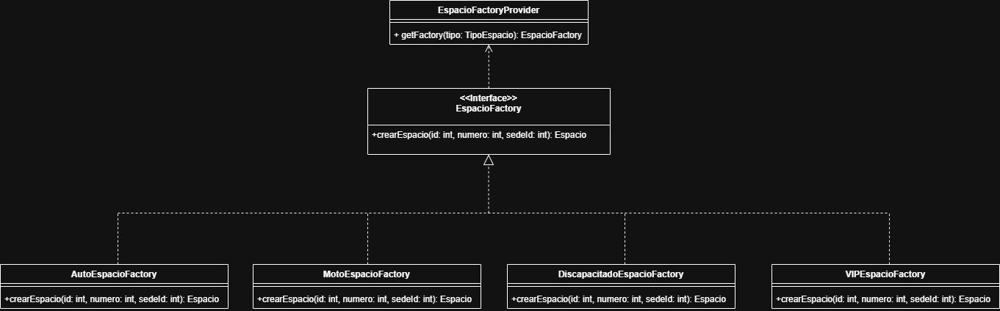
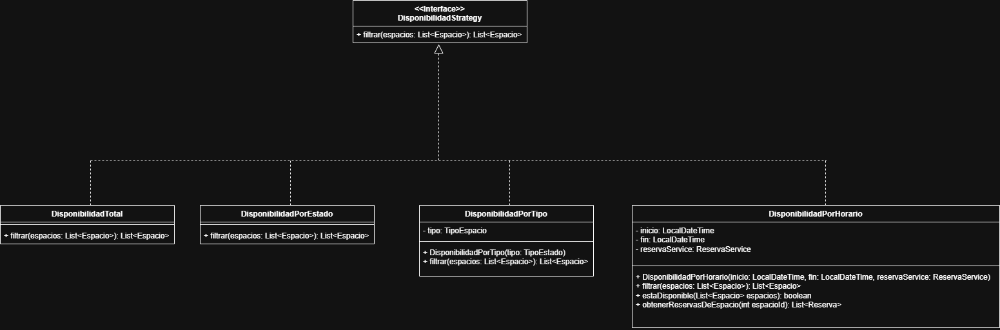

# 📚 DOCUMENTACIÓN - MÓDULO RESERVAS Y ESTACIONAMIENTO

**Autor:** Diego Heredia
**Fecha:** Diciembre 2025  
**Tecnología:** Spring Boot 3.5.8 + Java 17

---

## 📖 ÍNDICE

1. [Resumen Ejecutivo](#resumen)
2. [Arquitectura](#arquitectura)
3. [Patrones de Diseño](#patrones)
4. [Componentes Implementados](#componentes)
5. [Endpoints REST](#endpoints)
6. [Sedes y Espacios](#sedes-espacios)
7. [Disponibilidad de Espacios](#disponibilidad)
8. [Instalación y Uso](#instalacion)

---

## 1. RESUMEN EJECUTIVO <a id="resumen"></a>

### 1.1 Alcance del Módulo

Este módulo implementa la funcionalidad completa de:
- ✅ Gestion de Sedes y Espacios
- ✅ Filtrado de Disponinibilidad de Espacios
- ✅ Estados de espacio (DISPONIBLE, OCUPADO)
- ✅ Creación masiva de espacios por sede

### 1.2 Métricas del Proyecto

| Métrica | Cantidad |
|---------|----------|
| **Endpoints REST** | 12 |
| **Modelos** | 2 |
| **Services** | 2 |
| **Controllers** | 2 |
| **Patrones de Diseño** | 2 |

---

## 2. ARQUITECTURA <a id="arquitectura"></a>

### 2.1 Arquitectura en Capas

```
┌─────────────────────────────────────┐
│         CAPA PRESENTACIÓN           │
│   (Controllers - REST API)          │
├─────────────────────────────────────┤
│         CAPA NEGOCIO                │
│   (Services + Strategy + Factory)   │
├─────────────────────────────────────┤
│         CAPA DOMINIO                │
│   (Models + Enums)                  │
└─────────────────────────────────────┘
```

### 2.2 Estructura de Paquetes

```
com.parking.system/
├── controller/
│   ├── SedeController.java
│   └── EspacioController.java
├── service/
│   ├── SedeService.java
│   └── EspacioService.java
├── model/
│   ├── Sede.java
│   ├── Espacio.java
│   ├── TipoEspacio.java
│   └── EstadoEspacio.java
├── factory/
│   ├── EspacioFactory.java
│   ├── AutoEspacioFactory.java
│   ├── MotoEspacioFactory.java
│   ├── DiscapacitadoEspacioFactory.java
│   ├── VIPEspacioFactory.java
│   └── EspacioFactoryProvider.java
├── mapper/
│   ├── ReservaMapper.java
│   ├── CheckInMapper.java
│   ├── CheckOutMapper.java
│   └── PaseMensualMapper.java
└── strategy/
    ├── DisponibilidadStrategy.java
    ├── DisponibilidadPorTipo.java
    ├── DisponibilidadPorEstado.java
    ├── DisponibilidadPorHorario.java
    └── DisponibilidadTotal.java

```

---

## 2.3 Diagramas UML

### Diagrama 1: Módulo de Sedes y Espacios



**Muestra:**
- Modelos: Sede, Espacio
- Controllers y Services
- Relación Sede → Espacios
- Estados y tipos de espacio

---

### Diagrama 2: Patrón Factory Method – Espacios



**Muestra:**
- Interfaz EspacioFactory
- Fábricas concretas por tipo
- EspacioFactoryProvider como selector de fábrica

---

### Diagrama 3: Patrón Strategy – Disponibilidad



**Muestra:**
- Interfaz EspacioFactory
- Fábricas concretas por tipo
- EspacioFactoryProvider como selector de fábrica

---

## 3. PATRONES DE DISEÑO <a id="patrones"></a>

### 3.1 Simple Factory - Espacios ⭐

**Propósito:** Encapsular la creación de objetos Espacio según su tipo.

**Implementación:**
```java
// Interfaz Simple Factory
public interface EspacioFactory {
    Espacio crearEspacio(int id, int numero, int sedeId);
}

// Estrategia Concreta
@Component
public class PrecioPremiumStrategy implements PrecioPaseStrategy {
    public BigDecimal calcularPrecio() {
        return new BigDecimal("300.00");
    }
}

Cada tipo de espacio posee su propia fábrica concreta (AutoEspacioFactory, MotoEspacioFactory, DiscapacitadoEspacioFactory, VIPEspacioFactory).

La selección de la fábrica se realiza mediante:

EspacioFactory factory =
    EspacioFactoryProvider.getFactory(tipo);

```

**Beneficios:**
- ✅ Evita switch repetidos
- ✅ Centraliza la creación de objetos
- ✅ Cumple Open/Closed Principle


### 3.1 Simple Factory - Espacios ⭐

**Propósito:** Permitir distintos criterios de filtrado de espacios sin modificar el código existente.

**Implementación:**
```java
// Interfaz Strategy
public interface DisponibilidadStrategy {
    List<Espacio> filtrar(List<Espacio> espacios);
}

// Estrategia Concreta
public class DisponibilidadPorEstado implements DisponibilidadStrategy {
    @Override
    public List<Espacio> filtrar(List<Espacio> espacios) {
        return espacios.stream()
                .filter(e -> e.getEstado() == EstadoEspacio.DISPONIBLE)
                .collect(Collectors.toList());
    }
}

Estrategias implementadas:
- DisponibilidadPorTipo
- DisponibilidadPorEstado
- DisponibilidadPorHorario
- DisponibilidadTotal

```

**Beneficios:**
- ✅ Cada criterio es una clase independiente
- ✅ Fácil extensión de nuevos filtros
- ✅ Código limpio y mantenible
- ✅ Cumple SRP y OCP

---

## 4. COMPONENTES IMPLEMENTADOS <a id="componentes"></a>

### 4.1 Modelos

#### **Sede**
```java
public class Sede {
    private int id;
    private String nombre;
    private String direccion;
    private String ciudad;
}
```

**Espacio**
```java
public class Espacio {
    private int id;
    private int numero;
    private TipoEspacio tipo;
    private EstadoEspacio estado;
    private int sedeId;
}
```

#### **Estados posibles:**
```java
public enum EstadoEspacio {
    DISPONIBLE,
    OCUPADO,
    RESERVADO,
    MANTENIMIENTO
}

```

#### **Tipos de Espacio**
```java
public enum TipoEspacio {
    AUTO,
    MOTO,
    DISCAPACITADO,
    VIP
}
```

---

### 4.2 Servicios

#### **SedeService**

**Responsabilidades:**
- Crear, listar, actualizar y eliminar sedes
- Gestión de datos en memoria

**Método clave:**
```java
public Sede crearSede(String nombre, String direccion, String ciudad) {
        Sede nuevaSede = new Sede(siguienteId++, nombre, direccion, ciudad);
        sedes.add(nuevaSede);

        // Crear automáticamente 10 espacios de cada tipo (40 total)
        espacioService.crearMuchosEspacios(nuevaSede.getId());
        System.out.println(">>> Espacios creados para sede: " + nuevaSede.getNombre());

        return nuevaSede;
}
```

---

#### **EspacioService**

**Responsabilidades:**
- Crear espacios individuales
- Crear espacios masivos por sede
- Actualizar estado de espacios
- Filtrar disponibilidad usando Strategy Pattern

**Método clave:**
```java
public Espacio crearEspacio(int numero, TipoEspacio tipo, int sedeId) {
        EspacioFactory factory = EspacioFactoryProvider.getFactory(tipo);
        Espacio nuevoEspacio = factory.crearEspacio(siguienteId++, numero, sedeId);
        espacios.add(nuevoEspacio);
        return nuevoEspacio;
}
```
---

## 5. ENDPOINTS REST <a id="endpoints"></a>

### 5.1 Sedes (5 endpoints)

| Método | Endpoint      | Descripción     |
| ------ | ------------- | --------------- |
| GET    | `/sedes`      | Listar sedes    |
| POST   | `/sedes`      | Crear sede      |
| GET    | `/sedes/{id}` | Obtener sede    |
| PUT    | `/sedes/{id}` | Actualizar sede |
| DELETE | `/sedes/{id}` | Eliminar sede   |

**Ejemplo Crear Sede:**
```json
POST http://localhost:8080/sedes
Content-Type: application/json

{
  "nombre": "Sede Central",
  "direccion": "Av. Principal 123",
  "ciudad": "La Paz"
}
```

**Ejemplo Respuesta:**
```json
{
  "id": 5,
  "nombre": "Sede Central",
  "direccion": "Av. Principal 123",
  "ciudad": "La Paz"
}
```

---

### 5.2 Espacios (6 endpoints)

| Método | Endpoint                         | Descripción            |
| ------ | -------------------------------- | ---------------------- |
| GET    | `/espacios`                      | Listar espacios        |
| POST   | `/espacios`                      | Crear espacio          |
| GET    | `/espacios/sede/{id}`            | Espacios por sede      |
| PUT    | `/espacios/{id}/estado`          | Cambiar estado         |
| DELETE | `/espacios/{id}`                 | Eliminar espacio       |
| POST   | `/espacios/crearMuchos/{sedeId}` | Crear espacios masivos |


**Crear un Espacio**
```json
POST http://localhost:8080/espacios
Content-Type: application/json

{
  "numero": 1,
  "tipo": "AUTO",
  "sedeId": 1
}

```

**Ejemplo Respuesta**
```json
{
  "id": 201,
  "numero": 1,
  "tipo": "AUTO",
  "estado": "DISPONIBLE",
  "sedeId": 1
}
```
---

## 6. SISTEMA DE DISPONIBILIDAD <a id="disponibilidad"></a>

### 6.1 Filtrado por Tipo y Estado

Ejemplo:

```
GET /espacios/filtrar/tipo/AUTO
```
Devuelve solo espacios:

Tipo AUTO

Estado DISPONIBLE

### 6.2 Disponibilidad por Horario

La disponibilidad por horario se basa en la detección de solapamiento temporal con reservas existentes:

```java
boolean solapa =
    reserva.getFechaInicio().isBefore(fin) &&
    reserva.getFechaFin().isAfter(inicio);
```
Si existe solapamiento, el espacio no está disponible en ese rango.

---

## 7. VALIDACIONES <a id="validaciones"></a>

### 7.1 Validaciones de Espacio

| Validación    | Regla                                  |
| ------------- | -------------------------------------- |
| Sede válida   | La sede debe existir                   |
| Tipo válido   | TipoEspacio permitido                  |
| Estado válido | EstadoEspacio permitido                |
| Existencia    | No se actualizan espacios inexistentes |


### 7.2 Validaciones de Disponibilidad

No se devuelven espacios ocupados
No se devuelven espacios con solapamiento horario
Filtros combinables sin conflictos

---

## 8. INSTALACIÓN Y USO <a id="instalacion"></a>

### 8.1 Requisitos

- Java 17+
- Gradle 8.x
- Puerto 8080 disponible

### 8.2 Dependencias

```gradle
dependencies {
    implementation 'org.springframework.boot:spring-boot-starter-web'
    implementation 'org.springframework.boot:spring-boot-starter-data-jpa'
    runtimeOnly 'com.h2database:h2'
}
```

### 8.3 Ejecutar

```bash
# Compilar
./gradlew clean build -x test

# Ejecutar
./gradlew bootRun

# El servidor arranca en http://localhost:8080
```
---

## 📊 RESUMEN TÉCNICO

### Patrones de Diseño
- ✅ Simple Factory (espacios)
- ✅ Strategy Pattern (disponibilidad)

### Funcionalidades
- ✅ 12 endpoints REST
- ✅ Gestion de Sedes y Espacios
- ✅ Filtrado de Espacios Disponibles

---

## 🎯 CONCLUSIÓN

Este módulo implementa un sistema completo y profesional de gestión de reservas de estacionamiento con:
- Arquitectura en capas bien definida
- Patrones de diseño aplicados correctamente
- Código limpio y mantenible
